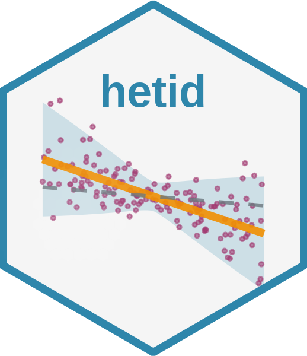

<!-- README.md is generated from README.Rmd. Please edit that file -->

# hetid 

<!-- badges: start -->

[](https://github.com/fernando-duarte/hetid/actions/workflows/R-CMD-check.yaml)
[](https://CRAN.R-project.org/package=hetid)
[](https://lifecycle.r-lib.org/articles/stages.html#experimental)
<!-- badges: end -->

## Overview

The **hetid** package implements identification through
heteroskedasticity methods from Lewbel (2012) for triangular systems,
with applications to the **Volatility Financial Conditions Index
(VFCI)** developed by Adrian, DeHaven, Duarte, and Iyer.

This package provides a complete toolkit for empirical macroeconomic
analysis using heteroskedasticity-based identification, including:

- **Data Management**: Access to ACM term structure data and economic
  variables
- **Bond Pricing**: Comprehensive bond pricing calculations and moment
  estimators
- **Identification**: Implementation of Lewbel (2012) identification
  methods
- **Optimization**: Tools for finding optimal identification parameters

## Key Methodology

The package implements the identification through heteroskedasticity
approach from Lewbel (2012), which exploits conditional
heteroskedasticity to identify structural parameters in triangular
systems:

    Y₁,t+1 = θ Y₂,t+1 + ε₁,t+1
    Y₂,t+1 = γ' Zₜ + ε₂,t+1

Identification is achieved through the moment condition:

    E[ε₁,t+1 ε₂,t+1 | Zₜ] = τ · Var(ε₂,t+1 | Zₜ)

This approach is particularly valuable when traditional instrumental
variables are unavailable or weak.

## Installation

You can install the development version of hetid from
[GitHub](https://github.com/) with:

``` r
# install.packages("pak")
pak::pak("fernando-duarte/hetid")
```

## Core Features

### 📊 Data Management

- **ACM Term Structure Data**: Monthly yields, term premia, and
  risk-neutral yields (1-10 years)
- **Economic Variables**: Quarterly macroeconomic and financial data
- **Automatic Updates**: Download latest data from Federal Reserve
  sources
- **Data Validation**: Built-in checks for data consistency and
  completeness

### 🧮 Bond Pricing Calculations

- **Expected Log Bond Prices** (`compute_n_hat`): Estimate
  E_t\[p\_(t+i)^(1)\]
- **Price News** (`compute_price_news`): Unexpected bond price changes
- **SDF Innovations** (`compute_sdf_innovations`): Stochastic discount
  factor innovations
- **Moment Estimators**: Supremum (`compute_c_hat`) and fourth moment
  (`compute_k_hat`) estimators
- **Variance Bounds** (`compute_variance_bound`): Empirical bounds for
  forecast errors

### 🔍 Identification Methods

- **Reduced Form Residuals**: Compute W₁ and W₂ residuals for
  identification
- **Quadratic Solvers**: Solve identification equations for structural
  parameters θ
- **Principal Component Optimization**: Find optimal PC weights for
  identification
- **Multi-maturity Analysis**: Simultaneous estimation across the yield
  curve

### ⚡ Optimization Tools

- **Weight Optimization**: Find optimal principal component combinations
- **Multi-start Algorithms**: Robust optimization with multiple starting
  points
- **Constraint Handling**: Built-in constraints for economic
  interpretability
- **Convergence Diagnostics**: Comprehensive optimization result
  analysis

## Quick Start

### Basic Workflow

``` r
library(hetid)

# 1. Data Setup
download_term_premia() # Download latest ACM data
data <- extract_acm_data(data_types = c("yields", "term_premia"))

# 2. Compute Reduced Form Residuals
w1_residuals <- compute_w1_residuals(n_pcs = 4)
w2_residuals <- compute_w2_residuals(
  yields = data[, grep("^y", names(data))],
  term_premia = data[, grep("^tp", names(data))],
  maturities = c(2, 5, 10)
)

# 3. Solve for Structural Parameters
result <- solve_theta_quadratic(
  pc_j = variables$pc1,
  w1 = w1_residuals$residuals,
  w2 = w2_residuals$residuals[[1]],
  tau = 0.5
)

# 4. Optimization (Optional)
optimal <- optimize_pc_weights(
  pcs = as.matrix(variables[, paste0("pc", 1:4)]),
  w1 = w1_residuals$residuals,
  w2 = w2_residuals$residuals[[1]],
  tau = 0.5
)
```

### Bond Pricing Examples

``` r
# Extract ACM data
data <- extract_acm_data(data_types = c("yields", "term_premia"))
yields <- data[, grep("^y", names(data))]
term_premia <- data[, grep("^tp", names(data))]

# Compute expected log bond prices
n_hat_5 <- compute_n_hat(yields, term_premia, i = 5)

# Compute price news (unexpected price changes)
price_news_5 <- compute_price_news(yields, term_premia, i = 5)

# Compute SDF innovations
sdf_innovations_5 <- compute_sdf_innovations(yields, term_premia, i = 5)

# Compute moment estimators
c_hat_5 <- compute_c_hat(yields, term_premia, i = 5) # Supremum estimator
k_hat_5 <- compute_k_hat(yields, term_premia, i = 5) # Fourth moment estimator

# Compute variance bound
var_bound_5 <- compute_variance_bound(yields, term_premia, i = 5)
```

## Mathematical Background

The identification strategy exploits heteroskedasticity in a triangular
system:

    Y₁,t+1 = θ Y₂,t+1 + ε₁,t+1
    Y₂,t+1 = γ' Zₜ + ε₂,t+1

The key insight from Lewbel (2012) is that identification can be
achieved through the moment condition:

    E[ε₁,t+1 ε₂,t+1 | Zₜ] = τ · Var(ε₂,t+1 | Zₜ)

This leads to a quadratic equation in θ:

    a θ² + b θ + c = 0

Where the coefficients depend on sample moments of the residuals and
principal components.

## Function Reference

### Data Functions

- `download_term_premia()` - Download ACM term structure data
- `extract_acm_data()` - Extract and process ACM data
- `load_term_premia()` - Load cached ACM data

### Bond Pricing Functions

- `compute_n_hat()` - Expected log bond prices
- `compute_price_news()` - Unexpected bond price changes
- `compute_sdf_innovations()` - SDF innovations
- `compute_c_hat()` - Supremum estimator
- `compute_k_hat()` - Fourth moment estimator
- `compute_variance_bound()` - Variance bounds

### Identification Functions

- `compute_w1_residuals()` - Primary endogenous variable residuals
- `compute_w2_residuals()` - Secondary endogenous variable residuals
- `solve_theta_quadratic()` - Solve identification equations
- `solve_theta_quadratic_lincomb()` - Solve with PC combinations

### Optimization Functions

- `optimize_pc_weights()` - Optimize principal component weights
- `optimize_theta_identification()` - Full identification optimization
- `optimize_theta_all_maturities()` - Multi-maturity optimization

## Data Sources

The package provides access to:

- **ACM Term Structure Data**: Monthly data from Adrian, Crump, and
  Moench (2013) including yields, term premia, and risk-neutral yields
  for 1-10 year maturities
- **Economic Variables**: Quarterly macroeconomic and financial
  variables including GDP, inflation, financial conditions indices, and
  principal components

## Analysis Scripts

The repository includes example scripts (not part of the package) for
comprehensive analysis:

1.  **`hetid_analysis_script.R`**: Complete analysis script that
    computes γ₁ roots for all combinations of principal components
    (j=1,…,J) and maturities (i=1,…,10)

2.  **`hetid_interactive_analysis.R`**: Interactive version allowing
    user to specify parameters and explore different configurations

3.  **`example_hetid_analysis.R`**: Simple demonstration of basic
    package functionality

To run the full analysis:

``` r
source("hetid_analysis_script.R")
```

Or for interactive exploration:

``` r
source("hetid_interactive_analysis.R")
```

## References

- Adrian, T., Crump, R. K., and Moench, E. (2013). “Pricing the term
  structure with linear regressions.” *Journal of Financial Economics*,
  110(1), 110-138.

- Adrian, T., DeHaven, M., Duarte, F., and Iyer, T. (2024). “The
  Volatility Financial Conditions Index.” *Working Paper*.

- Lewbel, A. (2012). “Using heteroscedasticity to identify and estimate
  mismeasured and endogenous regressor models.” *Journal of Business &
  Economic Statistics*, 30(1), 67-80.

## License

MIT © Fernando Duarte
