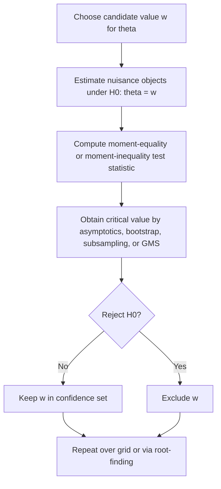

# Inference for Point Identified and Set Identified Scalar Triangular Systems

## Executive summary

I use the scalar triangular notation from your note: after residualizing both equations on the common controls \(X_t\), the target parameter is the scalar coefficient \(\theta\) in
\[
W_{1,t+1}=\theta W_{2,t+1}+\varepsilon_{1,t+1},\qquad W_{2,t+1}=\varepsilon_{2,t+1}.
\]
In this scalar setting, point identification means \(\theta\) is a singleton; set identification means \(\theta\) belongs to one interval, and each candidate \(w\in\Theta\) maps to a unique nuisance-coefficient vector through the same recovery map used in your TeX note. Lewbel’s heteroskedasticity construction gives point identification under exact orthogonality and heteroskedastic relevance, while the more recent instrument-free triangular literature gives either point identification through nonlinear higher-moment GMM or set identification through low-order moment bounds. fileciteturn0file2 fileciteturn0file3 citeturn5search0turn20search0turn5search3

For the **point-identified case**, the default inference methods are standard heteroskedasticity-robust IV/GMM asymptotics, delta-method standard errors for nonlinear GMM, and—when external or generated instruments may be weak—test inversion using Anderson–Rubin or conditional likelihood ratio methods. In practice, the most stable linear-IV tools are ordinary robust 2SLS/GMM, weak-IV-robust AR/CLR confidence sets, and, in clustered samples, wild-bootstrap inversion. Lewbel-style estimation in Stata is implemented by `ivreg2h`; in R, the closest mainstream packaged implementation is `REndo::hetErrorsIV` for point identification, together with general IV/GMM packages such as `ivreg`, `gmm`, `ivmodel`, and `fwildclusterboot`. fileciteturn0file3 citeturn6search0turn14view0turn14view1turn15search1turn18search4turn15search0

For the **set-identified case**, the literature splits into two families. One family is **endpoint-based inference** for a scalar identified interval \([L,U]\): Horowitz–Manski-style outer regions for the set, Imbens–Manski intervals for the true scalar parameter inside the set, Stoye’s refinements, and later “never-empty” intervals. The other family is **test-inversion / criterion / moment-inequality inference**: Chernozhukov–Hong–Tamer criterion-function confidence sets, Romano–Shaikh subsampling procedures for identified sets and identifiable subvectors, Andrews–Guggenberger plug-in or subsampling/bootstrap methods, Andrews–Soares generalized moment selection, and calibrated-projection methods of Kaido–Molinari–Stoye for scalar projections of multidimensional identified sets. These methods are directly relevant whenever your scalar \(\theta\)-interval can be written as bounds or as the projection of a larger moment-inequality region. citeturn3search0turn9search1turn4search1turn10search1turn10search2turn8search1turn4search0turn23academia44

For the specific **instrument-free triangular set-identification** method in the recent triangular-system paper, the direct packaged procedure is `trigmmset` in Stata. Its inference is plug-in and delta-method based: estimate the low-order-moment objects \(B_0\) and \(D_0\), estimate their joint covariance matrix, form an elliptical confidence region in \((B_0,D_0)\), and then take a worst-case outer region for \((\alpha,\gamma)\) over that ellipse. This is not the same object as an Imbens–Manski interval for a scalar endpoint pair, but it can be combined with projection-based procedures if you want a scalar confidence interval for \(\theta=\gamma\). citeturn20search0turn5search3

The software landscape is uneven. I found **direct, standard packaged support in Stata** for Lewbel-style point identification (`ivreg2h`), weak-IV robust inference (`weakiv`, `weakiv10`), and instrument-free triangular estimation and set bounds (`trigmm`, `trigmmset`). I found **R support for point identification** through `REndo`, `ivreg`, `gmm`, `ivmodel`, and `fwildclusterboot`, but I did **not** find a comparably standard CRAN package dedicated to scalar set-identified triangular IV inference or to `trigmmset`-style confidence regions. For general partial-identification subvector inference, the clearest official implementation I located is the **calibrated projection MATLAB package** documented by Kaido, Molinari, Stoye, and Thirkettle. Python has useful general GMM/IV infrastructure in `linearmodels` and `statsmodels`, but not a standard dedicated package for the set-identified scalar triangular problem. citeturn20search0turn6search0turn6search2turn6search3turn14view1turn15search3turn15search0turn15search1turn18search4turn12search0turn12search48turn17search0turn16search0

## Model and notation

Following your note, let the common-controls residualized system be
\[
W_{1,t+1}=\theta W_{2,t+1}+\varepsilon_{1,t+1},\qquad W_{2,t+1}=\varepsilon_{2,t+1},
\]
with candidate residual
\[
\varepsilon_{1,t+1}(w)=W_{1,t+1}-wW_{2,t+1}.
\]
Once \(w\) is fixed, the remaining structural coefficients are uniquely recovered by the same linear map as in your note, so scalar inference on \(\theta\) is the core object. That reduction is exactly why both point-identified and set-identified procedures can be organized as inference on a scalar or on the endpoints of a scalar interval. fileciteturn0file2 citeturn5search0

In Lewbel’s scalar triangular model, exact point identification comes from a variable \(Z\) satisfying
\[
\operatorname{Cov}(Z,\varepsilon_1\varepsilon_2)=0,\qquad 
\operatorname{Cov}(Z,\varepsilon_2^2)\neq 0,
\]
which implies that the generated instrument \((Z-\bar Z)\hat\varepsilon_2\) is valid and relevant for \(W_2\). In the single-endogenous-regressor case this gives a just-identified IV estimand; with additional external or generated moments one can also run overidentified GMM and Hansen-type tests. Baum and Lewbel explicitly recommend robust/GMM estimation in applications and emphasize the testing role of heteroskedasticity diagnostics and overidentification diagnostics when available. fileciteturn0file2 fileciteturn0file3 citeturn6search0

In the more recent instrument-free triangular paper, point identification is obtained from a nonlinear common-factor structure plus higher-moment/non-Gaussianity conditions, while set identification is obtained from lower-order moment bounds. The associated Stata commands are `trigmm` for point identification and `trigmmset` for set identification. The Stata Journal article makes clear that `trigmm` is estimated through Stata’s `gmm` framework and that `trigmmset` constructs a confidence region for low-order-moment objects and then maps that into a worst-case confidence region for the structural parameters. citeturn5search3turn20search0

## Point identified inference

### Linear asymptotic inference for Lewbel-style IV

When Lewbel identification is treated as a linear IV/GMM problem, the standard large-sample variance estimator is the usual sandwich covariance matrix for 2SLS or GMM, using the generated heteroskedasticity-based instrument in the instrument matrix. In practice, the safest baseline is heteroskedasticity-robust covariance; if there are clusters or serial dependence, use a cluster/HAC covariance accordingly. Baum and Lewbel explicitly recommend `robust` and usually `gmm2s` in `ivreg2h`, because this yields heteroskedasticity-robust GMM inference and Hansen’s \(J\)-test when the model is overidentified. fileciteturn0file3 citeturn6search0

In formulas, if \(g_i(\theta)=z_i(y_i-x_i'\beta-\theta d_i)\) are the sample moments after constructing the Lewbel instrument and stacking any exogenous instruments, then
\[
\sqrt{n}(\hat\vartheta-\vartheta_0)\ \overset{d}{\to}\ N(0,\; (G'WG)^{-1}G'WSWG(G'WG)^{-1}),
\]
with \(G\) the Jacobian of moments, \(S\) the long-run covariance of moments, and \(W\) the GMM weighting matrix. In the just-identified scalar case, that reduces to the familiar robust IV variance for \(\hat\theta\); if you need the standard error of any recovered nuisance coefficient \(\beta_1(\hat\theta)\), obtain it by the delta method from the joint covariance of \((\hat\beta_1^R,\hat\beta_2^R,\hat\theta)\). This is the cleanest route for the “other coefficients conditional on \(\theta\)” problem in your setting. citeturn15search0turn17search0

Finite-sample caveats matter. First, weak heteroskedasticity-based relevance makes Wald intervals unreliable, exactly as in ordinary IV. Second, generated instruments can behave poorly in short samples if the first-stage residuals or heteroskedasticity patterns are noisy. Third, if the model is exactly identified, there is no overidentification check. In practice this means: inspect first-stage relevance of the generated instrument, report robust standard errors, and where relevance is doubtful, prefer inverted tests to plain Wald intervals. fileciteturn0file3 citeturn6search2turn15search1turn18academia44

### Nonlinear GMM asymptotics for instrument-free triangular point identification

For `trigmm`-style point identification, the estimator is nonlinear GMM. The Stata Journal paper states that the command uses Stata’s built-in `gmm`, that the objective function can have multiple local minima, and that inference is reported through the GMM covariance matrix. Because several parameters are internally reparameterized to impose sign/nonnegativity restrictions, the command stores covariance matrices both in the transformed parameterization and in the original one; the mapping back to the original parameters is a delta-method transformation. citeturn5search3turn20search0

Operationally, the asymptotic formula is again a GMM sandwich, but now with a nonlinear Jacobian. If \(\psi_i(\eta)\) denotes the stacked nonlinear moments in the triangular common-factor model, then with \(\eta=(\alpha,\theta,\text{variance parameters},\ldots)\),
\[
\hat V_\eta=(\hat G'\hat W\hat G)^{-1}\hat G'\hat W\hat S\hat W\hat G(\hat G'\hat W\hat G)^{-1},
\]
and the reported standard errors are the square roots of the diagonal entries after mapping back from the transformed \(\log\)-variance/sign-constrained parameters. The paper’s examples also show that adding higher-order moments can materially reduce standard errors, but only at the cost of more nonlinear optimization and potentially more sensitivity to misspecification or local minima. citeturn5search3

The most important tuning choices here are practical rather than asymptotic: use many starting values, prefer robust weighting/covariance, check sensitivity across optimizers, and inspect the singular values of the sample Jacobian or the conditioning of the GMM problem. The authors explicitly recommend exploring multiple starting points because the objective function may have several local minima, especially in overidentified specifications. citeturn5search3

### Weak-IV robust and test-inversion methods

If you have an external instrument in the scalar single-IV case, or if you augment Lewbel moments with external instruments and worry about weak identification, standard weak-IV robust methods are still the benchmark. The `ivmodel` package provides Anderson–Rubin and conditional likelihood ratio confidence intervals for one endogenous variable, and Stata’s `weakiv`/`weakiv10` support weak-IV robust tests and confidence intervals after `ivreg2`, `ivreg2h`, and related estimators. These procedures avoid relying on a strong first-stage approximation in the way a conventional Wald interval does. citeturn15search1turn2search2turn2search3turn6search2turn6search3

For the scalar case, test inversion is conceptually simple. For each candidate \(w\), test
\[
H_0:\theta=w.
\]
In a linear IV model this can be done by Anderson–Rubin or CLR. In a nonlinear-GMM setting the analogous approach is to impose \(w\), re-estimate nuisance parameters, compute a GMM distance or score test, and retain the values of \(w\) not rejected at level \(\alpha\). The confidence set is then the collection of all nonrejected \(w\). This approach often behaves better than a symmetric Wald interval when the Jacobian is ill-conditioned or identification is weak. citeturn15search1turn4search1turn10search1

### Bootstrap methods for the point-identified case

The bootstrap is attractive because many IV and GMM intervals have important finite-sample distortions. Horowitz’s survey emphasizes that bootstrap methods can substantially improve coverage accuracy in econometric applications, especially relative to first-order asymptotics. In the IV context, the best-developed packaged option I found is wild-bootstrap test inversion through `fwildclusterboot` in R and `WildBootTests.jl`, which support IV objects from `ivreg` and provide confidence sets by inverting wild-bootstrap tests. citeturn15academia55turn18search4turn19search1

For plain Lewbel-style linear IV, an empirical bootstrap recipe is standard: resample observations or clusters, rebuild the Lewbel instrument each bootstrap draw, re-estimate \(\hat\theta^*\), and use the percentiles or Studentized distribution for a bootstrap interval. If clustering matters, use the wild cluster bootstrap rather than naive i.i.d. resampling. I did **not** find a standard dedicated package that automates this full bootstrap for `ivreg2h` or for `trigmm`; for those cases, users usually script the resampling manually on top of general IV/GMM code. That is a search-based conclusion, not a theorem. citeturn18search4turn19search1turn14view1turn20search0

## Set identified inference

### Direct triangular-system set inference through low-order moments

For the instrument-free triangular scalar case, the cleanest direct set-inference method now in software is `trigmmset`. The underlying paper defines two low-order-moment objects,
\[
B_0=\frac{E(W_1W_2)}{E(W_2^2)},\qquad
D_0=\frac{E(W_1^2)E(W_2^2)-E(W_1W_2)^2}{E(W_2^2)^2},
\]
and shows that for one sign normalization the structural pair \((\alpha,\gamma)\) must satisfy
\[
\gamma\le B_0\le \alpha,\qquad (B_0-\gamma)(\alpha-B_0)\le D_0.
\]
The Stata implementation estimates \((B_0,D_0)\) by plug-in estimators, estimates their covariance matrix by the delta method, forms an ellipse in \((B,D)\)-space using the \(\chi^2_2\) critical value, and then reports a worst-case region for \((\alpha,\gamma)\) that contains the union of all structural regions induced by \((B,D)\) values in that ellipse. citeturn5search3turn20search0

This is a **valid outer confidence region for the identified set**, not merely a pointwise interval for one endpoint. In the scalar problem you ultimately care about \(\theta=\gamma\), so the object of interest is the projection of that region onto the \(\gamma\)-axis. In the generic sign-normalized case, that projection can be one-sided or very wide; a finite scalar interval for \(\theta\) requires more structure than the bare second-moment bounds alone. That is why projection-based inference, rather than only endpoint plug-in intervals, is often the better conceptual match for your problem. citeturn5search0turn20search0turn23academia44

### Endpoint-based intervals for a scalar identified interval

Whenever your scalar identified set can be represented directly as an interval
\[
\Theta_0=[L_0,U_0],
\]
with estimators \((\hat L,\hat U)\) that are asymptotically normal, the classic literature gives several inference targets. Horowitz–Manski-type procedures aim to cover the **entire identified set**; Imbens–Manski intervals instead aim to cover the **true scalar parameter value** inside the set, which can be much shorter; Stoye shows where the original Imbens–Manski argument relied on a superefficiency issue and develops refinements; later Stoye proposes a simple “never-empty” interval with appealing finite-sample behavior. citeturn3search0turn9search1turn23academia54

The simplest set-covering outer interval is a Bonferroni or joint-normal endpoint construction:
\[
\mathcal C_{\text{set}}(\alpha)=
\bigl[\hat L-z_{1-\alpha/2}\,\widehat{\mathrm{se}}(\hat L),\;
      \hat U+z_{1-\alpha/2}\,\widehat{\mathrm{se}}(\hat U)\bigr],
\]
or, better, the projection of a joint elliptical confidence region for \((L_0,U_0)\). This has the practical advantage that it is easy to compute and naturally aligns with the identified-set target, but it is conservative when \(L_0\) and \(U_0\) are estimated jointly and highly correlated. citeturn3search0turn9search1

Imbens–Manski-style intervals are shorter because they target the unknown \(\theta\in[L_0,U_0]\) rather than the whole set. In the equal-variance or conservative-rescaling presentation, the interval is
\[
\mathcal C_{\text{IM}}(\alpha)=
\left[\hat L-c_n\widehat{\mathrm{se}}(\hat L),\;
      \hat U+c_n\widehat{\mathrm{se}}(\hat U)\right],
\]
where \(c_n\) is chosen from a one-dimensional normal-approximation equation that depends on the estimated width of the identified set. The practical message from Imbens–Manski is that this interval can be substantially shorter than a set-covering interval, but uniform validity near point identification requires the modified rather than naive version. Stoye’s papers are the right reference if you want to implement this carefully rather than heuristically. citeturn3search0turn22view0turn9search1turn23academia54

### Criterion-function and moment-inequality inference

A more robust route is to formulate the identified set through moments or a criterion function and then **invert tests**. Chernozhukov–Hong–Tamer treat partially identified models through criterion-function level sets: confidence sets are built from values of the parameter for which the sample criterion is sufficiently close to its minimum. Romano–Shaikh develop subsampling-based confidence regions both for identified sets and for identifiable parameters within partially identified models. Andrews–Guggenberger establish uniform validity for plug-in asymptotic, subsampling, and \(m\)-out-of-\(n\) bootstrap methods, while Andrews–Soares propose generalized moment selection to improve power in moment-inequality models. citeturn4search1turn10search1turn10search2turn8search1turn4search0

For your scalar problem, the generic inversion algorithm is:



If the null restrictions are **moment inequalities**, a common statistic is a studentized max violation,
\[
T_n(w)=\max_{j\le J}\frac{\sqrt n\,\bar m_j(w)}{\hat\sigma_j(w)},
\]
or a quadratic positive-part statistic. Andrews–Soares then adjust the critical value through generalized moment selection, effectively down-weighting or removing moments that look slack in the sample. The confidence set for \(\theta\) is the set of all \(w\) not rejected. This is often the best general-purpose strategy when your scalar interval arises as the projection of a more complicated region rather than from explicit endpoint formulas. citeturn4search0turn8search5turn8search6

### Subsampling, bootstrap, and calibrated projection

Subsampling has unusually strong theory in partially identified problems because ordinary bootstrap approximations can fail when limiting laws are discontinuous across data-generating processes. Romano–Shaikh and Andrews–Guggenberger show that subsampling and, under conditions, \(m\)-out-of-\(n\) bootstrap can deliver uniformly valid inference where naive \(n\)-out-of-\(n\) bootstrap can be unreliable. The standard tuning requirement is \(b\to\infty\) and \(b/n\to 0\), where \(b\) is the subsample size. In practice, researchers often try a small grid of \(b\) values, such as \(b\approx n^{1/2}\), as a sensitivity analysis rather than relying on a single automatic choice. citeturn10search1turn8search1turn8academia39turn18academia56

For scalar projections of multidimensional identified sets, calibrated projection is especially relevant. Kaido–Molinari–Stoye propose a bootstrap-calibrated projection method that directly targets a component or smooth functional—exactly the kind of object your scalar \(\theta\) is when it is one coordinate of a higher-dimensional partially identified region. Their official documented implementation is a MATLAB package. Among general-purpose partial-identification software I found, this is the clearest author-provided package for subvector inference. citeturn23academia44turn12search0turn12search48

## Software and code landscape

### Packages and author code I found

The most direct software for **Lewbel-style scalar point identification** is Stata’s `ivreg2h`, distributed through SSC. It constructs heteroskedasticity-based instruments, supports robust and GMM estimation, and is explicitly designed for the single-endogenous-regressor use case emphasized by Baum and Lewbel. The corresponding heteroskedasticity diagnostics discussed in the advice paper are available through `ivhettest`. fileciteturn0file3 citeturn6search0

In **R**, the most direct package I found for point-identified Lewbel estimation is `REndo`, whose `hetErrorsIV()` interface implements Lewbel’s heteroskedastic-error approach. `REndo` is on CRAN and GitHub, and its documentation explicitly lists the heteroskedastic-error approach among its core methods. By contrast, I did **not** locate a standard CRAN package that implements `trigmm`/`trigmmset`-style instrument-free triangular set inference in R. That is a search result, not a claim of impossibility. citeturn14view0turn14view1

For **general IV and GMM inference in R**, the useful building blocks are `ivreg` for 2SLS and diagnostics, `gmm` for user-supplied moment conditions and robust covariance estimation, `ivmodel` for one-endogenous-variable weak-IV robust intervals such as AR and CLR, and `fwildclusterboot` for bootstrap test inversion, including IV objects from `ivreg`. These do not directly solve your set-identified triangular problem, but together they cover most point-identified workflows and a large part of the test-inversion/bootstrap toolkit. citeturn15search3turn15search0turn15search1turn18search4turn19search1

For **Stata point and set identification without instruments**, the direct commands are `trigmm` and `trigmmset`, distributed through the Stata Journal software channel identified in the RePEc record. `trigmm` handles nonlinear GMM point identification; `trigmmset` handles low-order-moment set bounds and confidence regions. If you also want weak-IV robust procedures in Stata when external instruments are present, `weakiv` and `weakiv10` are the natural complements. citeturn20search0turn6search2turn6search3

For **general partial-identification / moment-inequality software**, the official package I found with the strongest direct relevance is the **calibrated projection MATLAB package** documented by Kaido, Molinari, Stoye, and Thirkettle. I did not find a comparably standard CRAN package aimed at econometric moment-inequality subvector inference in the same style. Related Stata packages exist for nearby bounds problems—`clrbound` for intersection bounds, `plausexog` for plausibly exogenous IV sensitivity analysis, `imperfectiv` for imperfect-IV bounds, and `kinkyreg` for kinky least squares—but these are adjacent rather than direct implementations of your triangular set-identified scalar problem. citeturn12search0turn12search48turn7search2turn7search0turn7search1turn6search1

In **Python**, `linearmodels` provides IV2SLS, LIML, k-class, and IVGMM with robust, clustered, and kernel covariance options, and `statsmodels` provides a more general GMM framework. This is enough to script Lewbel-style IV/GMM or criterion-based test inversion, but I did not find a standard Python package dedicated to the set-identified scalar triangular problem or to `trigmmset`-style inference. citeturn17search0turn17search1turn16search0

### Comparison table

| Method or package | Target | Main assumptions | What you get | Strengths | Weaknesses | Code availability |
|---|---|---|---|---|---|---|
| `ivreg2h` | Point | Lewbel exact validity, heteroskedastic relevance | 2SLS/GMM estimate, robust SEs, Hansen \(J\) if overidentified | Direct, mature, standard | No direct set-ID interval | Stata SSC / RePEc citeturn6search0 |
| `REndo::hetErrorsIV` | Point | Lewbel 2012 heteroskedasticity assumptions | Point estimate and reported SEs | Native R implementation | No packaged set-ID inference | CRAN + GitHub citeturn14view0turn14view1 |
| `trigmm` | Point | Instrument-free common-factor structure + higher moments/non-Gaussianity | Nonlinear GMM estimate and SEs | Direct for the recent triangular model | Local minima; no dedicated bootstrap found | Stata Journal channel citeturn20search0turn5search3 |
| `trigmmset` | Set | Instrument-free second-moment bounds | Confidence region for \((\alpha,\gamma)\), implied scalar projection | Direct packaged set inference | Region is conservative; scalar projection can be wide | Stata Journal channel citeturn20search0turn5search3 |
| Imbens–Manski / Stoye endpoint CI | Set or scalar-in-set | Asymptotically normal endpoint estimators | Scalar interval from estimated bounds | Simple, fast | Needs endpoint estimators, careful uniformity near point ID | Roll your own; literature-based citeturn3search0turn9search1turn23academia54 |
| Andrews–Soares GMS | Set | Moment inequalities/equalities, studentization | Inverted test confidence set | Uniformly valid, better power than naive plug-in | Tuning, simulation, coding burden | Theory references; no mainstream CRAN package found in search citeturn4search0turn8search5 |
| Romano–Shaikh subsampling | Set or projection | Weak regularity; subsampling validity | Uniformly valid test inversion | Robust when bootstrap is delicate | Computationally heavy; choose \(b\) | Theory references; custom code | citeturn10search1turn10search2turn8academia39 |
| CHT criterion sets | Set or projection | Criterion-function setup; extremum/QLR structure | Level-set confidence regions | Flexible, broad | Computationally intensive | Theory references; custom code | citeturn4search1 |
| KMS calibrated projection | Projection | Moment (in)equalities, bootstrap-calibrated relaxation | Component/function confidence interval | Tailored to scalar projections | Nontrivial optimization; MATLAB-centric | Official MATLAB package citeturn23academia44turn12search0turn12search48 |
| `ivmodel` / `weakiv` / `weakiv10` | Point | Linear IV with one endogenous regressor; external instrument setup | AR/CLR and weak-IV robust CIs | Gold standard for weak linear IV | Not direct for `trigmmset` | R and Stata packages citeturn15search1turn2search2turn6search2turn6search3 |
| `fwildclusterboot` / `WildBootTests.jl` | Point | Bootstrap validity; clustering setup | Inverted bootstrap tests and CIs | Strong finite-sample tool for IV with clustering | Not a direct triangular set-ID package | R + Julia/GitHub citeturn18search4turn19search1 |

## Practical implementation recipes

### Point-identified Lewbel recipe

Use this when you believe the exact Lewbel conditions hold. First regress \(Y_2\) on \(X\) and obtain \(\hat W_2\). Next construct the generated instrument
\[
\hat H_i=(Z_i-\bar Z)\hat W_{2i}.
\]
Then estimate the residualized structural equation by 2SLS or GMM using \(X\) and \(\hat H\) as instruments. Report heteroskedasticity-robust or cluster-robust standard errors. If you have extra instruments or extra generated moments, report Hansen’s \(J\)-test, but do not treat nonrejection as proof of validity. fileciteturn0file2 fileciteturn0file3 citeturn6search0

A practical R sketch looks like this:

```r
# Step 1: reduced form
rf <- lm(Y2 ~ X1 + X2 + X3, data = dat)
dat$w2hat <- resid(rf)

# Step 2: generated Lewbel instrument
dat$H <- (dat$Z - mean(dat$Z, na.rm = TRUE)) * dat$w2hat

# Step 3: IV with robust covariance
library(ivreg)
fit <- ivreg(Y1 ~ X1 + X2 + X3 + Y2 | X1 + X2 + X3 + H, data = dat)

# robust SE
library(sandwich)
library(lmtest)
coeftest(fit, vcov. = sandwich::vcovHC(fit, type = "HC1"))
confint.default(fit, vcov. = sandwich::vcovHC(fit, type = "HC1"))
```

If you want weak-IV robustness in the external-IV version of the same scalar model, replace the Wald interval by AR/CLR inversion using `ivmodel`, or use Stata’s `weakiv`/`weakiv10`. If you want bootstrap finite-sample correction with clustering, wrap the `ivreg` fit in `fwildclusterboot::boottest()` and invert the test numerically. citeturn15search3turn15search1turn18search4turn6search2turn6search3

For the nuisance coefficients conditional on \(\theta\), estimate \((\hat\beta_1^R,\hat\beta_2^R)\) from the residualization step and use the recovery map
\[
\hat\beta_1(w)=\hat\beta_1^R-\hat\beta_2^R\,w.
\]
Given any fixed \(w\), a robust standard error for \(\hat\beta_1(w)\) follows by the delta method from the joint covariance of \((\hat\beta_1^R,\hat\beta_2^R)\); if \(w=\hat\theta\), include the additional delta-method term for the randomness in \(\hat\theta\). In practice, stack the estimating equations or bootstrap the full procedure. citeturn15search0turn17search0

### Point-identified instrument-free triangular recipe

Use this when you want `trigmm`-style point identification. The practical steps are: choose the moment set \(p(0,1)\) or \(p(0,1,2)\); choose the sign normalization; run nonlinear GMM with robust weighting and several starting values; inspect convergence and sensitivity; and, if overidentified, inspect Hansen’s \(J\)-test and the conditioning of the sample Jacobian. The paper’s applied examples show that adding higher-order moments can sharply reduce standard errors, but only after a careful search over initial values. citeturn5search3

A generic pseudo-code version is:

```r
# User-defined moments psi_i(eta)
psi_fun <- function(theta, data) {
  # return n x q matrix of nonlinear moments
}

library(gmm)
fit <- gmm(g = psi_fun, x = dat, t0 = start_vals, vcov = "TrueFixed")  # or custom weighting
summary(fit)

# If parameters are transformed internally, delta-method back-transform
```

Because I did not find a native R package for `trigmm`, in R or Python this is currently a “roll your own moments” problem built on `gmm`, `statsmodels`, or `linearmodels`. In Stata, `trigmm` is the direct packaged route. citeturn20search0turn15search0turn16search0turn17search0

### Set-identified scalar-interval recipe from estimated endpoints

If you can compute estimated endpoints \((\hat L,\hat U)\) for your scalar interval \(\Theta_0\), the easiest valid outer interval is a set-covering one:
\[
\mathcal C_{\text{set}}=
[\hat L-z_{1-\alpha/2}\hat s_L,\ \hat U+z_{1-\alpha/2}\hat s_U],
\]
or the projection of a joint ellipse for \((L,U)\). This is what I would recommend when you want a transparent “confidence band for the identified set” and do not want to explain the difference between covering the set and covering the unknown point inside the set. citeturn3search0turn9search1

If instead you want an interval that covers the unknown scalar \(\theta\in[L,U]\) with probability \(1-\alpha\), use an Imbens–Manski/Stoye endpoint method. In code, compute \((\hat L,\hat U)\), their covariance matrix, solve the one-dimensional critical-value equation for \(c_n\), and return
\[
[\hat L-c_n\hat s_L,\ \hat U+c_n\hat s_U].
\]
When point identification is near, use the modified/uniform version rather than the naive one, and if endpoint estimators are nearly uncorrelated the 2020 Stoye interval is particularly attractive. citeturn3search0turn9search1turn23academia54

### Set-identified recipe by test inversion

If your scalar interval is really a projection of a moment-inequality region, do not force it into endpoint formulas too early. Instead, for each candidate \(w\), define moments \(m_j(w)\le 0\) that characterize admissibility of \(w\), compute a studentized test statistic, obtain a critical value by GMS, subsampling, or bootstrap, and retain nonrejected \(w\). This is the right generic recipe for adapting Andrews–Soares, Romano–Shaikh, or CHT ideas to your scalar triangular problem. citeturn4search0turn10search1turn4search1

A compact pseudo-code version is:

```r
theta_grid <- seq(theta_min, theta_max, length.out = 1000)
keep <- logical(length(theta_grid))

for (k in seq_along(theta_grid)) {
  w <- theta_grid[k]

  # 1. compute moment inequalities mbar(w) and studentized stats
  # 2. simulate or subsample the critical value c_alpha(w)
  # 3. keep w if test does not reject
  keep[k] <- (Tn_w <= c_alpha_w)
}

ci_theta <- range(theta_grid[keep])
```

Tuning guidance is straightforward. For GMS, use a moment-selection drift sequence \(\kappa_n\) that diverges but remains \(o(\sqrt n)\); in practice, researchers often use slowly diverging sequences like \(\sqrt{\log n}\). For subsampling, try \(b\in\{\lfloor n^{1/2}\rfloor,\lfloor 0.6n^{1/2}\rfloor,\lfloor 1.4n^{1/2}\rfloor\}\) and check robustness. For bootstrap or simulation-based critical values, use at least \(999\) draws for exploratory work and \(1{,}999\) or more for a final table. These are practical recommendations rather than theorem statements. citeturn4search0turn8search1turn8academia39turn18academia56

### Direct `trigmmset` recipe

If your maintained model is the instrument-free triangular one from the recent paper, the shortest route is the direct `trigmmset` logic. Estimate \(\hat B\) and \(\hat D\), estimate their covariance matrix by the delta method, build the ellipse
\[
\mathcal E_\delta=\{(B,D): (\hat\mu-\mu)' \hat V^{-1} (\hat\mu-\mu)\le \chi^2_{2,1-\delta}\},
\quad \mu=(B,D)',
\]
and then compute the worst-case outer region induced by all \((B,D)\in\mathcal E_\delta\). The scalar confidence set for \(\theta=\gamma\) is the projection of that region onto the \(\gamma\)-axis. If you want a tighter scalar projection than the Stata routine reports, a calibrated-projection method in the spirit of Kaido–Molinari–Stoye is the natural next step. citeturn5search3turn20search0turn23academia44

## Open questions and limitations

I found clear direct software for **point-identified Lewbel** inference and for **`trigmm`/`trigmmset` in Stata**, but I did **not** find a standard CRAN package that directly implements **set-identified scalar triangular inference** in the Lewbel-style or `trigmmset`-style problem. The closest standard tools in R are generic GMM/IV infrastructure for point identification and custom-coded moment-inequality or endpoint-based procedures for set identification. citeturn14view1turn20search0turn15search0turn15search3

I also did not locate a dedicated packaged bootstrap for `trigmm` or a mainstream packaged R implementation of Andrews–Soares / CHT / Romano–Shaikh procedures specialized to econometric moment-inequality models. The official software I did locate for subvector partial-identification inference is MATLAB-based calibrated projection. So, for your exact scalar triangular set-identified problem, the practical choice today is usually either: Stata `trigmmset`; or custom R/Python code built around endpoint methods, test inversion, or calibrated projection. citeturn12search0turn12search48turn20search0turn15search0turn17search0

Finally, some formulas in the partial-identification literature depend delicately on the exact inferential target—covering the whole identified set, covering the true point inside the set, or covering a projection of a higher-dimensional identified set. In your scalar triangular application, keeping those targets distinct is not optional: they produce genuinely different confidence intervals, often of very different lengths. citeturn3search0turn9search1turn23academia44